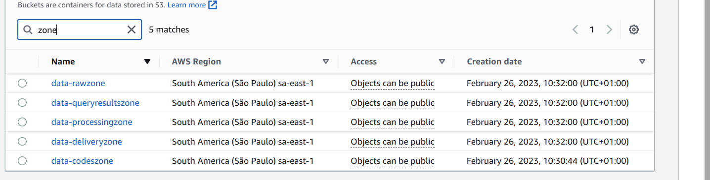

# ETL for Business Team

### This is a data pipeline built with the purpose of serving a business team.

First, the pipeline itself is a sequence of steps and relatively simple, as in the image below, where we use the **Step Function** tool as our main orchestrator.

<br />


<br />

All resource creation was done via **Cloudformation** and basically we have two stacks, one called _dataengineer-requirements_ where we create our codes bucket and our docker images repository and then the rest of all the necessary infrastructure for the pipeline called _dataengineer-stack_.

We've also created two **CICD pipelines**, one for creating resources whenever there's a PUSH on the master branch, and another for destroying resources that can be triggered manually.

<br />


<br />


This set of buckets creates our datalake and the data goes through the complete ETL process involving all the main layers, here we call _data-rawzone, data-processingzone and data-deliveryzone_.

<br />



<br />

Now let's get into the [lambda function code](https://github.com/camposvinicius/datachallenge_public_repo/blob/main/lambda_extract/lambda_function.py) and understand what it is all about.

<br />

```python
import requests, io, tempfile, os, boto3
from zipfile import ZipFile

file_name = '2m-Sales-Records.zip'
bucket = "data-rawzone"
url = 'https://eforexcel.com/wp/wp-content/uploads/2020/09/2m-Sales-Records.zip'

def lambda_handler(event, context):

    headers = {
        "User-Agent": "Mozilla/5.0 (X11; Linux x86_64; rv:60.0) Gecko/20100101 Firefox/60.0"
    }

    s3 = boto3.resource('s3')

    with tempfile.TemporaryDirectory() as temp_path:
        temp_dir = os.path.join(temp_path, 'temp')
        with open(temp_dir, 'wb') as f:
            req = requests.get(url, headers=headers)  
            f.write(req.content)
        
        s3.Bucket(bucket).upload_file(temp_dir, file_name)
    
        zip_obj = s3.Object(bucket_name=bucket, key=file_name)
        buffer = io.BytesIO(zip_obj.get()["Body"].read())
        
        z = ZipFile(buffer)
        for filename in z.namelist():
            s3.meta.client.upload_fileobj(
                z.open(filename),
                Bucket=bucket,
                Key='data/' + f'{filename}'
            )

    for file in s3.Bucket(bucket).objects.all():

        ## Removing the whitespaces in the filename

        if str(file).__contains__('data/'):
            OLD_NAME = file.key
            NEW = file.key.replace(" ", "_")

            try:
                s3.Object(bucket, NEW).copy_from(CopySource=f'{bucket}/{OLD_NAME}')
                s3.Object(bucket, OLD_NAME).delete()
            except:
                pass
            
        ## Moving original file to another prefix    

        elif str(file).__contains__('.zip'):
            OLD_PATH = file.key
            NEW_PREFIX = 'old-data/'+OLD_PATH

            try:
                s3.Object(bucket, NEW_PREFIX).copy_from(CopySource=f'{bucket}/{OLD_PATH}')
                s3.Object(bucket, OLD_PATH).delete()
            except:
                pass
```
<br />

Basically, we have a **containerized lambda function** that is making a request and writing the content, which is a zip file, inside a temporary directory to later upload to s3, unzip and extract the csv file that is inside it, replace the blank spaces in the filename by underscores and move the zip file to another prefix within the same bucket.

This is the result, where in data we have the renamed csv file and old-data we have the zip file.

<br />


<br />

After that, we have a **glue workflow using spark jobs and crawler** that will basically do:

Read the csv file from the raw zone &#8594; 
  Save to parquet in just a single partition in the processing zone &#8594;
    Save to parquet and partitioned by COUNTRY in the delivery zone &#8594; 
      Trigger the glue crawler to make the table available in Athena.

<br />


You can check what the **codes** are doing in the [code1](https://github.com/camposvinicius/datachallenge_public_repo/blob/main/gluejobs/glue_job_1.py) and [code2](https://github.com/camposvinicius/datachallenge_public_repo/blob/main/gluejobs/glue_job_2.py).

The results:

<br />


<br />


<br />

After the **crawler** runs, here is our final table with the data schema already enriched, since all the fields in our original schema were _strings_, which you can check how it was done in our glue spark job 1.

<br />


<br />

```sql
WITH metrics as (
    select 
        country,
        order_date,
        total_revenue,
        row_number() over (partition by country order by total_revenue desc) as R
    from data_deliveryzone where country in ('Canada', 'United States of America')
)
SELECT
    country,
    order_date,
    total_revenue
FROM
    metrics
where R <=2    
order by 3 desc;
```

<br />


Where we use this simple query as an example to get the two biggest revenues from Canada and USA, and your order dates.

And finally we have the destruction of resources via our CICD pipeline that we mentioned at the beginning.

<br />


<br />


You can understand the code to construct [here](https://github.com/camposvinicius/datachallenge_public_repo/blob/main/.github/workflows/deploy.yml) and 
to destroy [here](https://github.com/camposvinicius/datachallenge_public_repo/blob/main/.github/workflows/destroy.yml)
